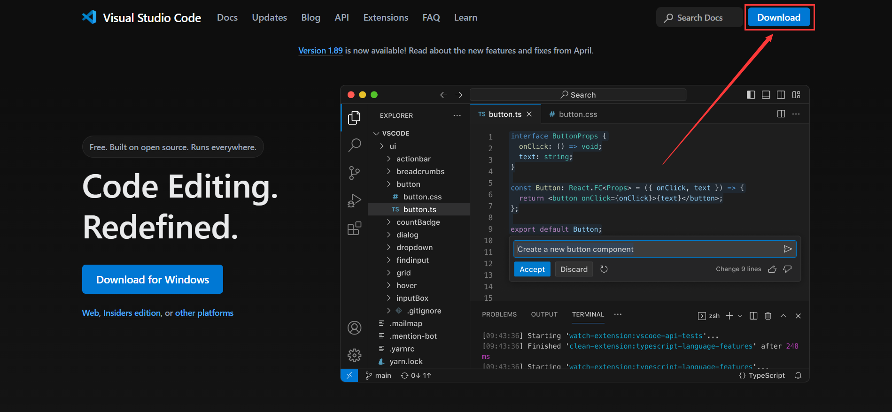
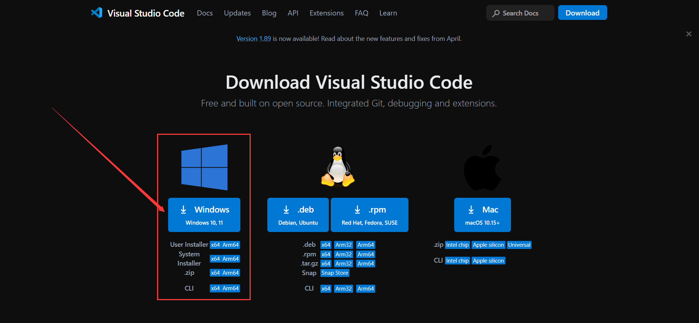
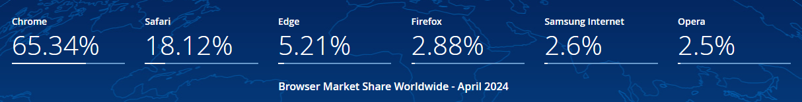

# 前端开发IDE的选择

> 工欲善其事，必先利其器。

## 什么是IDE？

IDE是集成开发环境（Integrated Development Environment）的缩写，它是一种软件应用程序，提供了一整套用于软件开发的工具和功能，帮助开发者更高效地编写、调试、测试和部署代码。

## 为什么要使用IDE？

为我们开发赋能，提高开发效率，提供更好的开发体验。

## 前端开发常用的IDE

### 🔥 WebStorm

WebStorm 是 JetBrains 公司开发的一款商业化的面向Web前端开发的IDE，需要付费使用。

### 🔥 Visual Studio Code

Visual Studio Code 是微软公司开发的一款免费开源的轻量级代码编辑器，支持多种编程语言，拥有丰富的插件生态。

目前上面两款IDE是前端开发中比较常用的IDE，同学们可以将这两款IDE都安装到电脑上，亲自使用过后根据自己的喜好选择。

:::info{title="Tips"}
其他IDE还有HBuilderX、Atom、Notepad++、Sublime等等。

HbuilderX：国内DCloud公司开发的一款免费的IDE [(https://hx.dcloud.net.cn/)](https://hx.dcloud.net.cn/)。

Atom: GitHub 官方正式发文宣布，已在 2022.12.15，停止Atom代码编辑器的维护。
:::

## 为什么选择VS Code？

- VS Code是免费的，不需要付费，无版权问题。
- VS Code 是微软公司开发的，有强大的团队支持，有着丰富的插件生态。
- 轻量级的代码编辑器，启动速度快，占用内存小。
- 使用的开发者较多，有着丰富的社区资源。

> 注：开发工具的选择是个人的喜好问题，不同的开发者有不同的选择，只要能够满足开发需求即可，这里只是提供一些建议。


## VS Code 的安装

:::danger{title="注意"}
是Visual Studio Code (VS Code) 不是 Visual Studio

Visual Studio 也是微软公司开发的一款IDE，但是它是一个重量级的IDE，适合大型项目的开发。

主要针对于Windows平台，支持多种编程语言，包括C++、C#、Visual Basic等，专注于Microsoft技术栈。
:::

目前只展示了Windows下的安装，其他系统的安装方式可以参考官网的文档或相关系统的下载方式。

VS Code 官方网站：[https://code.visualstudio.com/](https://code.visualstudio.com/)

打开官网后，点击右上角Download按钮，选择对应的系统版本进行下载，默认安装即可。





如果你更习惯命令行的方式，那么你可以在命令行中使用`code`命令快速打开VS Code。

:::info{title="Tips"}
VS Code 在安装的时候会将`VS Code 安装目录bin下的code.cmd`自动添加到环境变量中，因此同学们也可以在命令行中直接使用`code`命令来打开某个项目和文件。

```bash
code .  # 打开当前目录
code index.html # 打开index.html文件
code my-project # 打开my-project项目
```

:::

## VS Code 常用插件

- `Auto Close Tag` 自动添加 HTML/XML 关闭标签
- `Auto Rename Tag` 自动重命名配对的 HTML/XML 标记
- `open in browser` 可以在默认浏览器中打开当前文件
- `Live Server` 本地服务器，实时预览
- `Image preview` 图片预览
- `Error Lens` 在代码中显示错误信息
- `indent-rainbow` 彩虹缩进线

同学们可以在使用VS Code开发的时候，提前将以上插件安装到VS Code中，以提高开发效率。

:::info{title="Tips："}
目前只是一些前端开发在VS Code中常用的插件，在后续的学习中，会有更多的插件逐步添加到VS Code中。
:::

## 🎯 浏览器的选择

浏览器是前端开发中最重要的工具之一，目前市面上主流的浏览器有Chrome、Firefox、Safari、Edge等，如此多的浏览器应用，那我们在开发中应该选择哪个浏览器呢？

建议：选择全球浏览器市场份颤最大浏览器以及国内市场份额最大的浏览器，这样可以更好的保证网站的兼容性和更好的用户体验。


数据来源：[Statcounter 5月全球浏览器市场份额](https://gs.statcounter.com/)

所以我们在开发中选择Chrome浏览器，在特定的场景下再考虑对其他浏览器进行测试和兼容性的工作。

## 参考

- [集成开发环境介绍](https://baike.baidu.com/item/集成开发环境)
- [Webstorm](https://www.jetbrains.com/zh-cn/webstorm/)
- [HbuilderX](https://www.dcloud.io/hbuilderx.html)
- [浏览器份额](https://gs.statcounter.com/browser-market-share)