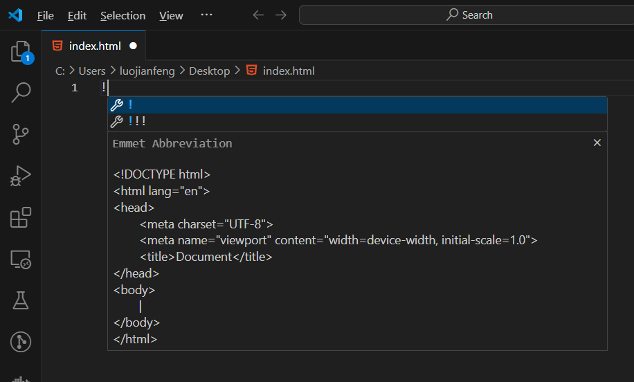
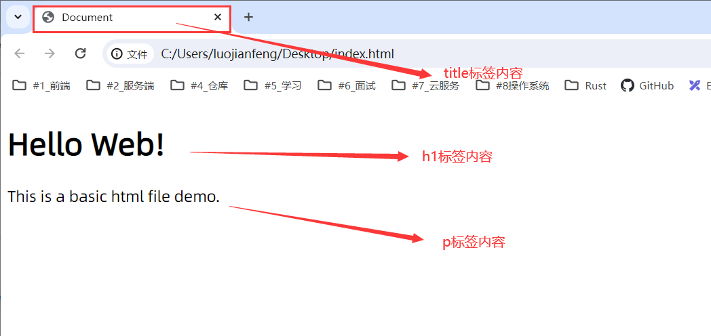

# 运行第一个HTML文件

## 一、 快速创建第一个HTML文件

目前我们已经了解了HTML的基本概念，接下来我们将通过实际操作来生成和编写一个HTML文件，然后通过浏览器运行并查看页面效果。

> 注：以下操作是在VS Code中进行的，其他编辑器也有类似的操作。

:::info{title="建议："}
建议同学们使用VS Code的英文版本，提前养成在一个英文开发的环境中编程的习惯，这样可以更好的适应未来的学习和工作环境，切记要避免使用中文拼音来命名这一陋习！！！。
:::

打开`VS Code`，在编辑器的左上角点击`File` -> 然后点击`New File` 或者 `New Text File`，新建一个文件，保存为`index.html`或者其他名称，但请保证文件是以`.html`结尾的。

HTML文件一般是以`.html`或者`.htm`为后缀的文本文件。请同学们在创建文件时，注意不要出现`[xxx].html.html`的双重html的后缀名文件，不要犯糊涂哦！！！

:::details{title="拓展：.html和.htm文件扩展名的区别"}

.html 和 .htm 文件扩展名都是用于HTML文件的。它们之间的区别很小，主要涉及历史和兼容性方面：

**区别**：

`.html`: 是标准的文件扩展名，表示HTML文件。随着时间的推移，.html成为了普遍使用的扩展名。

`.htm`: 在早期的Windows操作系统（如MS-DOS和Windows 3.x），文件名被限制为8.3格式，即文件名最长8个字符，扩展名3个字符。因此，HTML文件使用.htm作为扩展名。

**兼容性**:

现代操作系统和浏览器可以识别和处理这两种扩展名。因此，无论使用.html还是.htm，文件都可以正常工作。

建议同学在今后的开发中统统使用`.html`作为HTML文件的扩展名，在此提出来两者的区别只是让同学知道即可，在理论上的补充。

:::

`VS Code` 提供了快速生成HTML文件基础模板结构的快捷键`!`，如下图所示，来创建一个基础的HTML文件模板：




:::danger{title="注意："}
请注意中英文键盘的切换，`!`快捷键是在英文键盘下，不是在中文键盘下。
:::

```html title="index.html"
<!DOCTYPE html>
<html lang="en">
<head>
    <meta charset="UTF-8">
    <meta name="viewport" content="width=device-width, initial-scale=1.0">
    <title>Document</title>
</head>
<body>
</body>
</html>
```

至此，我们通过使用`VS Code`快速的生成和创建了一个HTML文件。

## 二、 在HTML文件中添加内容

我们直接运行目前所创建的HTML文件是没有效果的，它只是一个空结构的HTML文件，除了`<title>`标签里面的内容会展示在浏览器的导航栏上外，其他结构中内容都是功能性内容，无展示。

所以，我们还得在目前创建的HTML文件中添加一些内容，以便于我们能够真实看到页面的效果。

因此，我们在代码第9行，第10行，分别添加了`<h1></h1>`标题标签和`<p></p>`段落标签这两个标签，同时分别添加上了一小段文字，如下代码。

```html {9,10}
<!DOCTYPE html>
<html lang="en">
<head>
    <meta charset="UTF-8">
    <meta name="viewport" content="width=device-width, initial-scale=1.0">
    <title>Document</title>
</head>
<body>
    <h1>Hello Web!</h1>
    <p>This is a basic html file demo.</p>
</body>
</html>
```
:::info{title="提示："}

标签内容会在下一节中详细介绍，目前同学们可以把标签理解成一个容器，里面可以放置内容，浏览器会根据标签的不同来展示不同的内容。

:::

目前我们的HTML文件中已经添加了一些内容，接下来我们将运行这个HTML文件，查看页面效果。

## 三、 运行我们的HTML文件

之前我们在安装VS Code的时候，同时也安装了两个插件`open in browser` 和 `Live Server`，

- `open in browser`插件可以帮助我们在浏览器中打开我们的HTML文件，只需要在当前文件上鼠标右键，选择`Open In Default Browser` 或者 `Open In Other Browsers`即可，但通过这样的方式打开的HTML文件是静态的，不会实时的更新，在每次修改完成保存后，都需要手动刷新页面。

- `Live Server `插件可以帮助我们在本地创建一个服务器，在我们修改完保存时，同时实时的将我们的修改内容同步到浏览器，方便查看。

目前同学们只需随便选择一个插件的方式运行即可。

:::details{title="拓展：热更新（HMR：Hot Module Replacement)"}
热更新是指在开发过程中，当我们修改了代码后，浏览器会自动刷新，显示最新的效果。这样可以提高开发效率，不需要每次修改完代码后手动刷新浏览器。
:::



最终，如上所示，我们实现了一个html文件的快速生成和运行，非常简单。


## 参考

- [MDN Web Docs](https://developer.mozilla.org/zh-CN/docs/Learn/HTML)