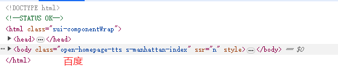
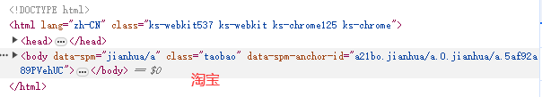

# HTML基本结构

## HTML文件基本结构的解释

我们在上一节成功的在浏览器上面运行了我们有生以来第一个HTML（可能也不是😃），现在我们来研究研究一下这个HTML文件的结构。

把我们上一节运行的HTML文件拿过来，结构如下：

```html
<!DOCTYPE html>
<html lang="en">
    <head>
        <meta charset="UTF-8">
        <meta name="viewport" content="width=device-width, initial-scale=1.0">
        <title>Document</title>
    </head>
    <body>
        <h1>Hello Web!</h1>
        <p>This is a basic html file demo.</p>
    </body>
</html>
```

整个HTML文件十分简单，只有短短的12行，这12行，整体来看被划分成为两个部分。

- 第一个部分：`<!DOCTYPE html>`
- 第二个部分：`<html>...</html>`

```html
<!DOCTYPE html>
<html lang="en">
</html>
```

第`1`行，顾名思义，是一个声明，用来告诉浏览器这个文件是一个HTML文件。

第`2`行，是一个`<html>`标签，这个标签是整个HTML文件的根标签，所有的HTML代码都应该放在这个标签里面。

如何在整个HTML文件中，我们可以看到，`<html>`标签里面又包含了两个部分：

- 第一个部分：`<head>...</head>`
- 第二个部分：`<body>...</body>`

```html
<html>
    <head></head>
    <body></body>
</html>
```

`<head>`标签是用来放置一些元数据的，比如：字符编码、视口设置、页面标题等等。

`<body>`标签是用来放置页面的主要内容的，比如：段落、标题、图片等等。


目前同学们只需要知道一个HTML文件最基本结构，后面我们会详细的讲解`<head>`标签和`<body>`标签里面的内容。

## 一些网站的HTML基本结构截图





同学可以看到无论多么复杂的网站，其HTML文件的基本结构都是一样的，只是内容多了而已。

可以看到，本质上学习HTML就是学习如何写这些标签，如何组织这些标签，如何让这些标签组合成一个网站，接下来我们将逐步的给大家介绍这些标签。